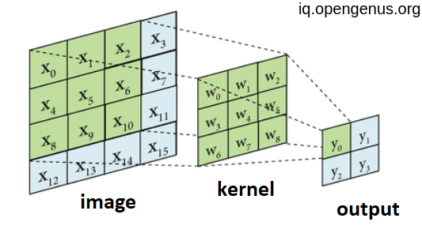
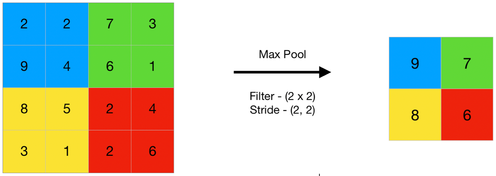

# Convolution Layers Implementation - ML Engineering Assignment 3

## Overview

In this assignment, you will implement 2D Convolutional and Max Pooling layers - the fundamental building blocks of Convolutional Neural Networks (CNNs). These layers introduce spatial awareness and are essential for computer vision tasks.

## Why Convolutions Matter

Convolutions are powerful because they:
- **Preserve spatial relationships** in data (unlike fully connected layers)
- **Share parameters** across spatial locations (translation invariance)
- **Detect local patterns** like edges, textures, and shapes
- **Reduce parameters** compared to fully connected layers for images
- **Form the backbone** of modern computer vision architectures

## Tasks

You need to implement two layers in `layers/convolution.py`:

### 1. Conv2D (2D Convolutional Layer)

**What it does:** Applies learnable filters across spatial dimensions to detect features.

**Mathematical Operation:**
```
Output[n,c_out,h,w] = bias[c_out] + Σ(weight[c_out,c_in,kh,kw] * input[n,c_in,h+kh,w+kw])
```

**Visual Representation:**



**Parameters:**
- `in_channels`: Number of input channels (e.g., 3 for RGB images)
- `out_channels`: Number of filters/output channels
- `kernel_size`: Size of convolving kernel (e.g., 3 for 3×3 filters)
- `stride`: Step size when moving the kernel (default: 1)
- `padding`: Zero-padding added to input borders (default: 0)
- `bias`: Whether to add learnable bias term (default: False)

**Key Concepts:**
- **Filters/Kernels:** Small learnable weight matrices that detect patterns
- **Feature Maps:** Output channels representing detected features
- **Receptive Field:** Region of input that influences one output pixel

### 2. MaxPool2D (2D Max Pooling Layer)

**What it does:** Downsamples feature maps by taking maximum values in local regions.

**Mathematical Operation:**
```
Output[n,c,h,w] = max(Input[n,c,h*stride:h*stride+kernel_size,w*stride:w*stride+kernel_size])
```

**Visual Representation:**



**Parameters:**
- `kernel_size`: Size of pooling window
- `stride`: Step size (defaults to kernel_size if not specified)
- `padding`: Zero-padding (default: 0)

**Key Concepts:**
- **Downsampling:** Reduces spatial dimensions while preserving important features
- **Translation Invariance:** Small shifts in input don't dramatically change output
- **Computational Efficiency:** Fewer parameters in subsequent layers

## Implementation Details

### Output Size Calculation

For both Conv2D and MaxPool2D:
```
Output_height = floor((Input_height + 2*padding_h - kernel_h) / stride_h) + 1
Output_width = floor((Input_width + 2*padding_w - kernel_w) / stride_w) + 1
```

### Common Configurations

**Conv2D Examples:**
```python
# Standard 3x3 conv with padding (preserves spatial size)
conv1 = Conv2D(3, 32, kernel_size=3, padding=1)

# Strided conv for downsampling
conv2 = Conv2D(32, 64, kernel_size=3, stride=2, padding=1)

# 1x1 conv for channel mixing
conv3 = Conv2D(64, 128, kernel_size=1)

# Large receptive field
conv4 = Conv2D(128, 256, kernel_size=7, padding=3)
```

**MaxPool2D Examples:**
```python
# Standard 2x2 max pooling (halves spatial dimensions)
pool1 = MaxPool2D(kernel_size=2, stride=2)

# Overlapping pooling
pool2 = MaxPool2D(kernel_size=3, stride=2)

# Large pooling window
pool3 = MaxPool2D(kernel_size=4, stride=4)
```

### Weight Initialization

Conv2D uses **Kaiming/He initialization** which is optimal for ReLU activations:
```python
# Good for layers followed by ReLU
nn.init.kaiming_uniform_(self.weight, a=math.sqrt(5))
```

## Getting Started

### 1. Understand Input/Output Shapes

```python
# Input: (batch_size, channels, height, width)
x = torch.randn(4, 3, 32, 32)  # 4 RGB images of size 32×32

# Conv2D: transforms channels and potentially spatial dims
conv = Conv2D(in_channels=3, out_channels=16, kernel_size=3, padding=1)
conv_out = conv(x)  # Shape: (4, 16, 32, 32)

# MaxPool2D: preserves channels, reduces spatial dims
pool = MaxPool2D(kernel_size=2, stride=2)
pool_out = pool(conv_out)  # Shape: (4, 16, 16, 16)
```

### 2. Implement Conv2D

**Key tasks:**
- Store all hyperparameters as instance variables
- Convert int parameters to tuples using `_pair()` helper
- Create weight parameter with shape `(out_channels, in_channels, kernel_h, kernel_w)`
- Initialize weights with Kaiming initialization
- Create bias parameter with shape `(out_channels,)` if needed

**Implementation hints:**
```python
def __init__(self, in_channels, out_channels, kernel_size, stride=1, padding=0, bias=False):
    # Convert single ints to tuples
    self.kernel_size = _pair(kernel_size)
    self.stride = _pair(stride)
    self.padding = _pair(padding)
    
    # Weight shape: (out_channels, in_channels, kernel_h, kernel_w)
    self.weight = nn.Parameter(torch.empty(out_channels, in_channels, *self.kernel_size))
    
    # Initialize weights
    nn.init.kaiming_uniform_(self.weight, a=math.sqrt(5))

def forward(self, x):
    # Your implementation here
```

### 3. Implement MaxPool2D

**Key tasks:**
- Store hyperparameters (kernel_size, stride, padding)
- Handle stride=None case (default to kernel_size)
- No learnable parameters needed!

**Implementation hints:**
```python
def __init__(self, kernel_size, stride=None, padding=0):
    self.kernel_size = _pair(kernel_size)
    self.stride = _pair(stride) if stride is not None else self.kernel_size
    self.padding = _pair(padding)

def forward(self, x):
    # your implementation here
```

### 4. Test Your Implementation

```bash
# Test individual layers
uv run pytest tests/test_convolution.py::TestConv2D -v
uv run pytest tests/test_convolution.py::TestMaxPool2D -v

# Test everything
uv run pytest tests/test_convolution.py -v
```

## Common CNN Patterns

Once implemented, you can create typical CNN building blocks:

### Basic CNN Block
```python
# Feature extraction block
conv = Conv2D(3, 32, kernel_size=3, padding=1, bias=True)
relu = ReLU()  # From previous assignment!
pool = MaxPool2D(kernel_size=2, stride=2)

# Forward pass
x = torch.randn(1, 3, 64, 64)  # RGB image
x = conv(x)    # (1, 32, 64, 64) - extract features
x = relu(x)    # (1, 32, 64, 64) - add non-linearity  
x = pool(x)    # (1, 32, 32, 32) - downsample
```

### Multi-Layer CNN
```python
# Typical CNN architecture pattern
def simple_cnn():
    layers = []
    
    # Block 1: 3 -> 32 channels
    layers.extend([
        Conv2D(3, 32, kernel_size=3, padding=1, bias=True),
        ReLU(),
        MaxPool2D(2)
    ])
    
    # Block 2: 32 -> 64 channels  
    layers.extend([
        Conv2D(32, 64, kernel_size=3, padding=1, bias=True),
        ReLU(),
        MaxPool2D(2)
    ])
    
    # Block 3: 64 -> 128 channels
    layers.extend([
        Conv2D(64, 128, kernel_size=3, padding=1, bias=True),
        ReLU(),
        MaxPool2D(2)
    ])
    
    return layers

# Usage: 224x224 -> 28x28 with rich features
```

## Understanding Receptive Fields

The **receptive field** is the region of input that influences one output pixel:

```python
# Each layer expands the receptive field
conv1 = Conv2D(3, 32, kernel_size=3)    # Receptive field: 3×3
conv2 = Conv2D(32, 64, kernel_size=3)   # Receptive field: 5×5  
conv3 = Conv2D(64, 128, kernel_size=3)  # Receptive field: 7×7

# Max pooling also expands receptive field
pool = MaxPool2D(kernel_size=2, stride=2)  # 2× expansion
```

## Debugging Tips

### Shape Debugging
```python
# Always print shapes during development
x = torch.randn(1, 3, 32, 32)
print(f"Input shape: {x.shape}")

x = conv(x)
print(f"After conv: {x.shape}")

x = pool(x)
print(f"After pool: {x.shape}")
```

### Parameter Counting
```python
# Check parameter counts
conv = Conv2D(32, 64, kernel_size=3, bias=True)
total_params = sum(p.numel() for p in conv.parameters())
print(f"Total parameters: {total_params}")
# Expected: 64*32*3*3 + 64 = 18,496
```

### Gradient Verification
```python
# Ensure gradients flow properly
x = torch.randn(1, 3, 32, 32, requires_grad=True)
y = conv(x)
loss = y.sum()
loss.backward()

assert conv.weight.grad is not None
assert x.grad is not None
```

## Testing Checklist

Your implementation will be tested on:

- ✅ **Correct parameter shapes and initialization**
- ✅ **Output shape calculations for various configurations**
- ✅ **Equivalence with PyTorch's nn.Conv2d and nn.MaxPool2d**
- ✅ **Gradient flow through layers**
- ✅ **Edge cases:** 1×1 convs, large kernels, asymmetric shapes
- ✅ **Combined Conv+Pool operations**
- ✅ **Parameter counting accuracy**

## Common Pitfalls

- **Shape errors:** Ensure weight tensor has correct 4D shape `(out_ch, in_ch, kh, kw)`
- **Tuple conversion:** Remember to convert int parameters to tuples
- **Stride defaults:** MaxPool2D stride should default to kernel_size when None
- **Bias handling:** Properly handle bias=False case
- **Parameter registration:** Use `nn.Parameter()` for learnable weights

## Mathematical Background

### Convolution Operation
The 2D convolution computes correlations between filters and local image patches:
```
(f * g)[m,n] = ΣΣ f[i,j] * g[m-i, n-j]
```

### Why It Works
- **Local connectivity:** Each output depends on a small input region
- **Parameter sharing:** Same filter applied across all locations
- **Translation equivariance:** Shifting input shifts output by same amount

## Resources

- [PyTorch Conv2d Documentation](https://pytorch.org/docs/stable/generated/torch.nn.Conv2d.html)
- [PyTorch MaxPool2d Documentation](https://pytorch.org/docs/stable/generated/torch.nn.MaxPool2d.html)
- [Understanding Convolutions](https://pytorch.org/tutorials/intermediate/spatial_transformer_tutorial.html)
- [CNN Architectures Guide](https://pytorch.org/tutorials/beginner/blitz/cifar10_tutorial.html)

## Next Steps

After completing this assignment, you'll be ready to:
1. **Build complete CNN architectures** (LeNet, AlexNet-style networks)
2. **Implement other conv layers** (Depthwise, Transpose convolutions)
3. **Add normalization layers** (BatchNorm, LayerNorm)
4. **Create modern architectures** (ResNet blocks, attention mechanisms)